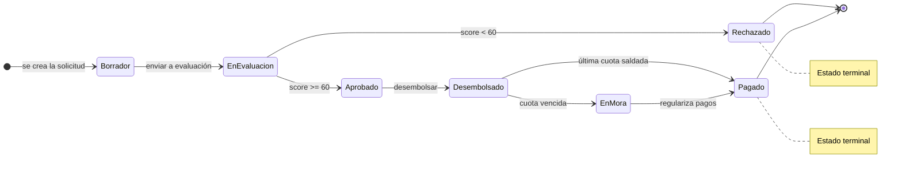

# Máquina de estados del préstamo

Estados y transiciones **legales** de un préstamo. El conjunto de estados es cerrado
(sealed interface [`EstadoPrestamo`](../src/main/java/gt/edu/umg/prestamos/dominio/estado/EstadoPrestamo.java))
y las transiciones se validan en
[`Prestamo.cambiarEstado()`](../src/main/java/gt/edu/umg/prestamos/dominio/prestamo/Prestamo.java);
cualquier transición fuera de este diagrama lanza `TransicionInvalidaException`.

## Datos que carga cada estado

Cada estado es un `record` inmutable con su propia información:

| Estado | Campos |
|---|---|
| `Borrador` | `fechaCreacion` |
| `EnEvaluacion` | `fechaInicio`, `evaluador` |
| `Aprobado` | `fechaAprobacion`, `scoreObtenido` |
| `Rechazado` | `fechaRechazo`, `motivo` |
| `Desembolsado` | `fecha`, `montoDesembolsado` |
| `Pagado` | `fechaUltimoPago` |
| `EnMora` | `diasAtraso`, `montoVencido` |

## Reglas de transición (resumen)

- `Borrador` → solo `EnEvaluacion`
- `EnEvaluacion` → `Aprobado` **o** `Rechazado`
- `Aprobado` → solo `Desembolsado`
- `Desembolsado` → `Pagado` **o** `EnMora`
- `EnMora` → solo `Pagado`
- `Rechazado` y `Pagado` son **terminales** (no admiten más transiciones)
