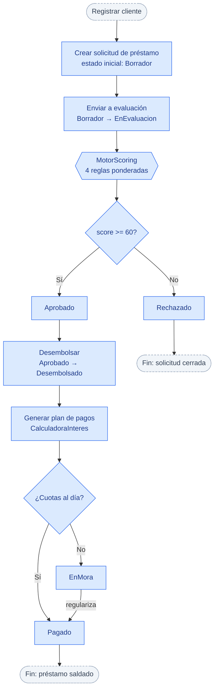
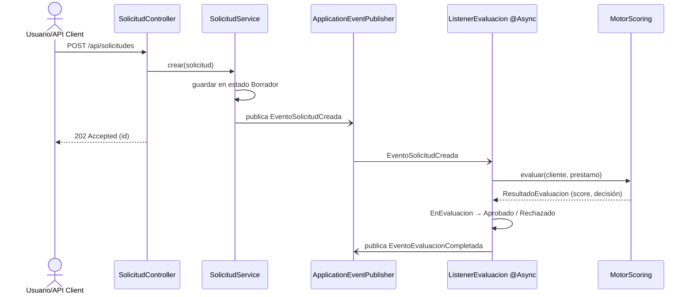

# Flujo del proceso de préstamo (end-to-end)

Recorrido completo de una solicitud, desde que se registra el cliente hasta que se
genera el plan de pagos. Cada bloque indica **en qué fase del roadmap** se implementa,
para distinguir lo que ya existe (Fase 1: dominio) de lo que viene después.

> 🔵 **Azul** = lógica de dominio ya implementada (Fase 1).
> ⬜ **Gris punteado** = orquestación en capas superiores (servicios/API/eventos, Fases 3–4).

## Evaluación asíncrona (objetivo de la Fase 4)

Cuando se implemente el componente asíncrono, la evaluación no bloqueará la respuesta
HTTP: la API responde `202 Accepted` y un listener evalúa en segundo plano.

> Nota: en la Fase 1 solo existe el **dominio** (`MotorScoring`, estados, calculadoras).
> Los servicios, controladores y listeners de este diagrama corresponden a las Fases 3 y 4.
