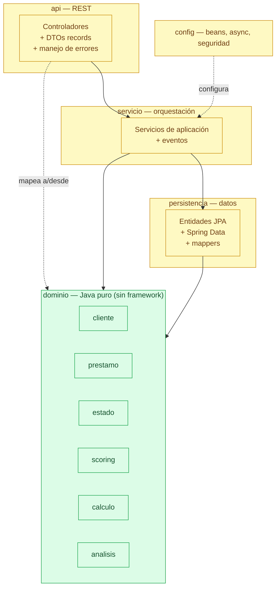

# Arquitectura de capas (monolito modular)

El sistema es un **monolito modular** (no microservicios). Las dependencias apuntan
siempre **hacia el dominio**: el paquete `dominio` es Java puro y no conoce a ninguna
otra capa ni a ningún framework.

> 🟢 **Verde** = Java puro (`dominio`). 🟡 **Amarillo** = capas con framework (Spring/JPA).

## Regla de arquitectura NO NEGOCIABLE

Está **prohibido** importar `org.springframework.*`, `jakarta.persistence.*` o cualquier
framework dentro de `gt.edu.umg.prestamos.dominio`. Si algo parece requerir una anotación
de framework en el dominio, la solución es crear un adaptador en la capa correspondiente
(entidad JPA separada, DTO, configuración), **no** anotar el dominio.

## Responsabilidad de cada capa

| Capa | Responsabilidad | Estado |
|---|---|---|
| `dominio` | Modelo y lógica de negocio pura | ✅ Fase 1 |
| `persistencia` | Entidades JPA, repositorios, mappers | ⏳ Fase 2 |
| `servicio` | Orquestación, casos de uso, eventos | ⏳ Fases 3–4 |
| `api` | Controladores REST, DTOs, errores, OpenAPI | ⏳ Fase 3 |
| `config` | Configuración de Spring (async, beans) | ⏳ Fases 4–5 |
