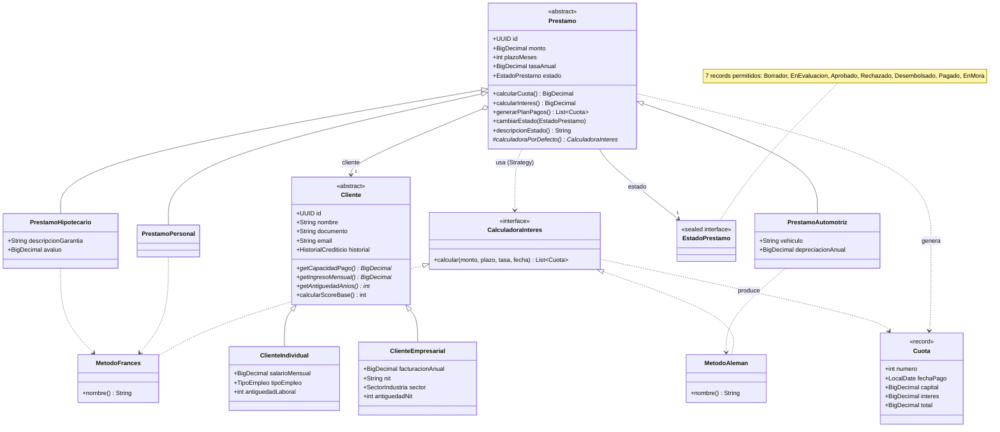

# Modelo de dominio (diagrama de clases)

Jerarquías del Entregable 1 tal como están implementadas en `dominio` (Fase 1). Las
jerarquías son **cerradas**: no se agregan más tipos de cliente, préstamo, estado,
regla ni calculadora que los aquí mostrados.

## Notas de diseño

- `Cliente` y `Prestamo` son **abstractos**; el comportamiento específico (capacidad de
  pago, método de amortización) se resuelve por polimorfismo.
- El método de amortización es un **Strategy** (`CalculadoraInteres`): Personal e
  Hipotecario usan francés (cuota fija); Automotriz usa alemán (capital constante,
  acorde a la depreciación del bien).
- Todo monto es `BigDecimal` con escala 2 y `RoundingMode.HALF_UP`.
- El scoring tiene su propio diagrama: ver [05-motor-scoring.md](05-motor-scoring.md).
