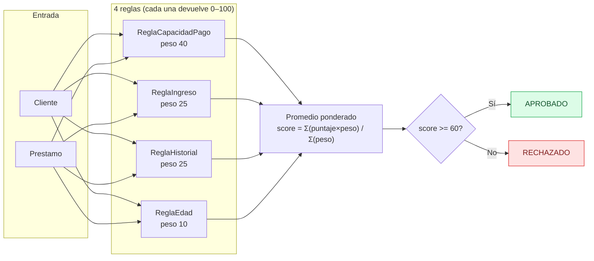
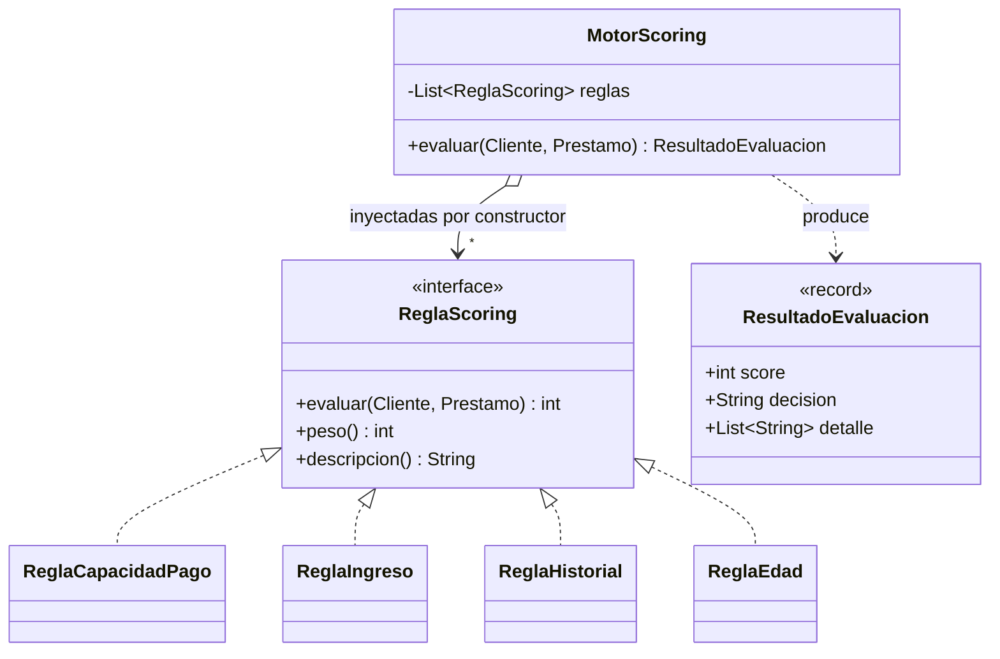

# Motor de scoring

Evaluación **100% determinista y basada en reglas** (mismo input → mismo output).
El [`MotorScoring`](../src/main/java/gt/edu/umg/prestamos/dominio/scoring/MotorScoring.java)
recibe una lista de reglas (patrón **Strategy** + principio **OCP**), calcula un
**promedio ponderado** y decide de forma binaria.

## Brackets de cada regla (constantes documentadas en código)

| Regla | Peso | Criterio | Puntajes |
|---|---|---|---|
| `ReglaCapacidadPago` | **40** | ratio = cuota estimada / capacidad de pago mensual | ≤0.30 → 100 · ≤0.40 → 70 · ≤0.50 → 40 · resto → 0 |
| `ReglaIngreso` | **25** | ingreso mensual del cliente | ≥5000 → 100 · ≥3000 → 60 · ≥1500 → 30 · resto → 0 |
| `ReglaHistorial` | **25** | historial crediticio almacenado | BUENO → 100 · REGULAR → 60 · MALO → 0 |
| `ReglaEdad` | **10** | antigüedad del vínculo (laboral / NIT), en años | ≥5 → 100 · ≥2 → 70 · ≥1 → 40 · resto → 0 |

Los pesos suman 100 y son **fijos**: nunca se calculan dinámicamente ni se configuran
por request.

## Estructura (Strategy + OCP)

> **OCP:** para cambiar el comportamiento del scoring se combinan reglas distintas al
> construir el `MotorScoring`, sin modificar su código. Las reglas de dominio son puras:
> no consultan sistemas externos ni burós de crédito.

## Ejemplo (verificado en los tests)

Cliente con salario Q10 000 (FORMAL, capacidad Q3 500), historial BUENO, 3 años de
antigüedad; préstamo personal de Q12 000 a 12 meses al 12% (cuota ≈ Q1 066.19):

| Regla | Puntaje | × Peso |
|---|---|---|
| CapacidadPago (ratio 0.3046) | 70 | 2800 |
| Ingreso (10000 ≥ 5000) | 100 | 2500 |
| Historial (BUENO) | 100 | 2500 |
| Edad (3 años) | 70 | 700 |
| **Score = 8500 / 100** | **85** | → **APROBADO** |
