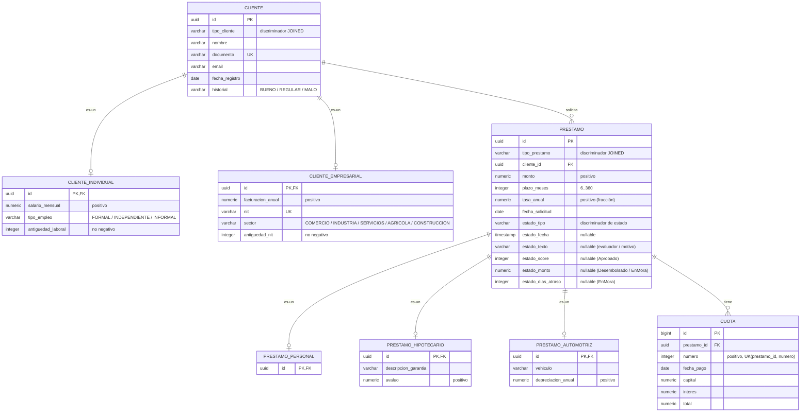

# Modelo de datos (diagrama entidad-relación)

Esquema relacional de la **Fase 2** (persistencia), tal como lo crea la migración
`src/main/resources/db/migration/V1__esquema_inicial.sql`. Refleja la estrategia de
herencia **`JOINED`** (una tabla base + una tabla por subtipo que comparte la PK y la
referencia por FK) y el estado del préstamo **aplanado** en columnas.

## Notas de diseño

- **Herencia `JOINED`.** `CLIENTE_INDIVIDUAL`/`CLIENTE_EMPRESARIAL` y las tres tablas de
  préstamo comparten la clave primaria con su tabla base (`id` es a la vez **PK y FK**). Una
  fila base tiene **como máximo una** fila de subtipo (relación `||--o|`), determinada por el
  discriminador (`tipo_cliente` / `tipo_prestamo`). Esto permite `NOT NULL` real en los
  campos propios de cada subtipo.
- **Estado del préstamo aplanado.** En vez de una tabla aparte, el estado vive como columnas
  en `PRESTAMO`: el discriminador `estado_tipo` + columnas de datos nullables que, en
  conjunto, cubren los 7 records de `EstadoPrestamo`. El `EstadoMapper` reconstruye el record
  exacto al leer. Ver [01-maquina-estados.md](01-maquina-estados.md).
- **Plan de pagos.** `CUOTA` guarda el plan (snapshot determinista) con una restricción
  `UNIQUE (prestamo_id, numero)` para que no se repitan números de cuota dentro de un
  préstamo.
- **Restricciones de integridad.** FKs entre subtipos y base, `UNIQUE` en `documento` y
  `nit`, y `CHECK` de montos positivos, rango de plazo y dominios de enumerados (ver el SQL
  de la migración y [docs/fase2-persistencia.md](../docs/fase2-persistencia.md)).
- **Correspondencia con el dominio.** Este diagrama es el reflejo *relacional* del
  [modelo de dominio](04-modelo-dominio.md); las entidades JPA de `persistencia.entidad`
  se traducen a las clases de dominio mediante mapeadores manuales.
